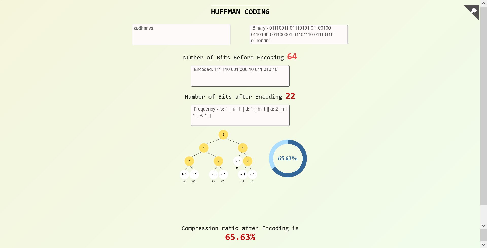

# HUFFMAN CODING 

This is a mini project on the subject **Design and Analysis of Algorithm(18CS42)** where we have implemented Huffman Coding Algorithm.

This app takes a string from user then encodes it and further Calculates the compression ratio after encoding.


## Screenshots




## Tech Stack

### HTML5 ,CSS3 , Vanilla JS


## Library Used

**D3.js** is a JavaScript library for manipulating documents based on data. D3 helps you bring data to life using HTML, SVG, and CSS

```bash
  npm install d3
```


## Try App Yourself!

[Click Here!](https://g-s-3.github.io/Huffman/)
